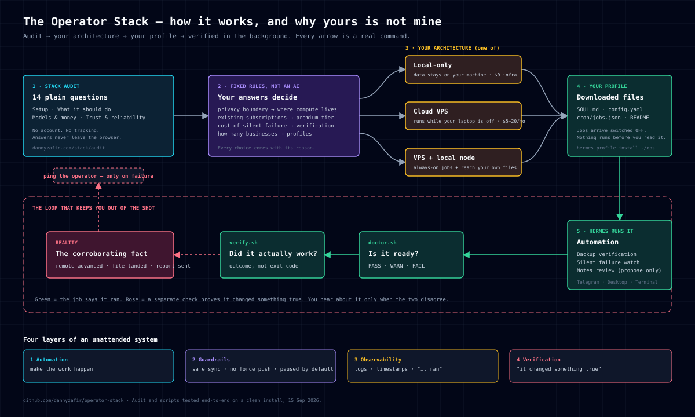

# 00. How the audit decides

The [Stack Audit](https://www.dannyzafir.com/stack/audit) is fourteen plain questions and a fixed rule table. No model, no account, no network call — your answers never leave the browser. This page shows which answer moves which part of the result, so you can see why you got the stack you got and disagree with it if you want to.

## What each answer changes

| You answer… | It decides… | Possible outcomes |
|---|---|---|
| How many businesses you operate | **Profiles** | one `default` profile · `ops` + one profile per project |
| How you feel about a terminal | **How much is scripted for you** | more explanation and paused-by-default jobs for terminal-averse operators |
| Whether a computer stays online | **Where scheduled work lives** | your laptop (stops when it sleeps) · your own hardware · a cloud VPS |
| Whether it must reach your local files | **Whether a local execution node exists** | VPS only · VPS + local node |
| What it should do | **Which automations are included** | backup verification · silent failure watch · notes review · none yet |
| How you want to talk to it | **Interfaces** | Telegram · Discord · desktop app · terminal only |
| Premium subscriptions you already pay for | **Premium tier** | your existing Claude or ChatGPT plan · none |
| Pay-per-use providers you already have | **Routine and fallback tiers** | OpenRouter for routine · Groq as fallback · "second provider required" |
| What matters most | **How much redundancy the stack earns** | cost-first · balance · intelligence · reliability |
| Monthly cost that feels reasonable | **The cost estimate's ceiling** | $0 · under $20 · $20–60 · over $60 |
| What a silent failure would cost | **Whether verification is optional** | "verify the first manual result" · "outcome checks are required" |
| Where your notes live | **Knowledge layer** | Obsidian curator (review-only) · Markdown export boundary · none |
| Strongest privacy boundary | **Architecture, above everything else** | local-only · own hardware · trusted cloud |

The privacy answer wins ties. If you say data must stay on your computer, the VPS is excluded even if you also said you want work to run while the laptop is off — and the result tells you that trade-off in plain words.

## What every result has in common

Whichever architecture you get, the last three steps are the same:

1. Run `scripts/doctor.sh` and produce one real readiness result.
2. Run your first automation **manually** before scheduling it.
3. Pair it with `scripts/verify.sh`, then schedule both.

That is deliberate. The architecture varies. The discipline does not.

## What the downloaded profile contains

The audit produces a Hermes profile distribution — a folder, not a script that runs things:

| File | What it is |
|---|---|
| `distribution.yaml` | Name, version, the env vars you must supply (e.g. a Telegram token) |
| `SOUL.md` | Operating rules: report outcomes not activity, stay silent when nothing is wrong, never claim success without evidence |
| `config.yaml` | Deliberately does **not** pin a model. You choose that at `hermes setup`, so the profile doesn't go stale when model names change |
| `cron/jobs.json` | Your scheduled jobs. They arrive **paused**, with the reason written into each job |
| `README.md` | Every decision above, restated with the answer that caused it |

Install it with `hermes profile install ./ops --alias`. Then `hermes -p ops cron list --all` shows the paused jobs, and `hermes -p ops cron resume <id>` starts one you have read.

Verified 15 Sep 2026: a profile generated by the audit installed cleanly on Hermes ≥0.12, all three jobs arrived paused, and `doctor.sh` reported the profile as present. Nothing ran until told to.

## If you disagree with the result

Change the answer and run it again. It is deterministic — same answers, same stack. If the rule itself is wrong for your situation, that is worth knowing, and the [newsletter](https://danny-zafirovic.beehiiv.com/) is where those cases get discussed.
